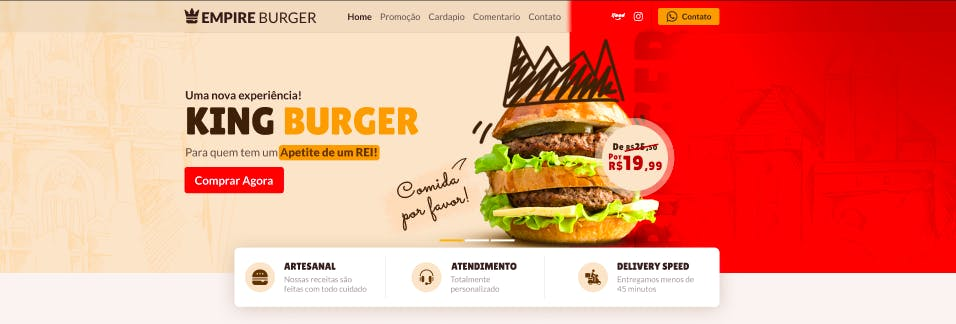

<h1 align="center">
  
</h1>

  

## 💻 Projeto

Esse projeto é uma landing page de uma hamburgueria fictícia chamada **Empire Burger**, nela há seções sobre as ofertas especiais, horário de funcionamento, cardápio contendo os ingredientes e preços, cards com os feedbacks dos clientes e a localização do estabelecimento.

Para facilitar a codificação do projeto foi usado um protótipo do figma como base, o autor do layout é o design [**Tiago Alves**](https://www.behance.net/tiagofenixe9d9), [clique aqui](https://www.figma.com/file/ag4Az50adOF53pBrwI0wFg/Empire-Burger?node-id=0%3A1) para abrir o protótipo no figma.

## 🚀 Tecnologias

- [Item 1](http://localhost:3000/)
- [Item 2](http://localhost:3000/)
- [Item 3](http://localhost:3000/)

## 📝 Critérios de aceite

- [ ] Criar as seguintes seções: Menu, Banner hero, Ofertas especiais, Onde fica o nosso castelo, Footer.

- [ ] Ao clicar em um item do menu, o usuário deverá ser levado para a seção correspondente.

- [ ] Na seção Ofertas especiais os elementos devem ser organizados com o uso da propriedade display:grid do css.

- [ ] As informações do card da oferta(nome do prato e gramagem) devem estar no html, a única imagem deve ser a foto do prato com o preço.

- [ ] Na seção Onde fica o nosso castelo você deverá incorporar uma localização do google maps.

### Nível Médio

- [ ] Todos os requisitos do nivel fácil.

- [ ] Criar as seguintes seções: Cardápio, Atendimento, Nossas entregas.

- [ ] Na seção Cardápio os preços devem ser formatados com o método Intl.NumberFormat.

- [ ] O card Horário de funcionamento deverá ter os estados aberto e fechado, o estado será alterado conforme o horário do navegador do usuário.

### Nível Difícil

- [ ] Todos os requisitos do nivel fácil e médio

- [ ] Criar as seguintes seções: Nossa realeza, Publicações do instagram.

- [ ] Buscar a lista de itens do cardápio via api.

- [ ] Buscar a lista de depoimentos via api.

- [ ] Na seção Nossa realeza os depoimentos deverão estar em um carrousel funcional.

- [ ] O texto de cada depoimento deverá estar limitado em quatro linhas, você pode usar a propriedade clamp do css.
